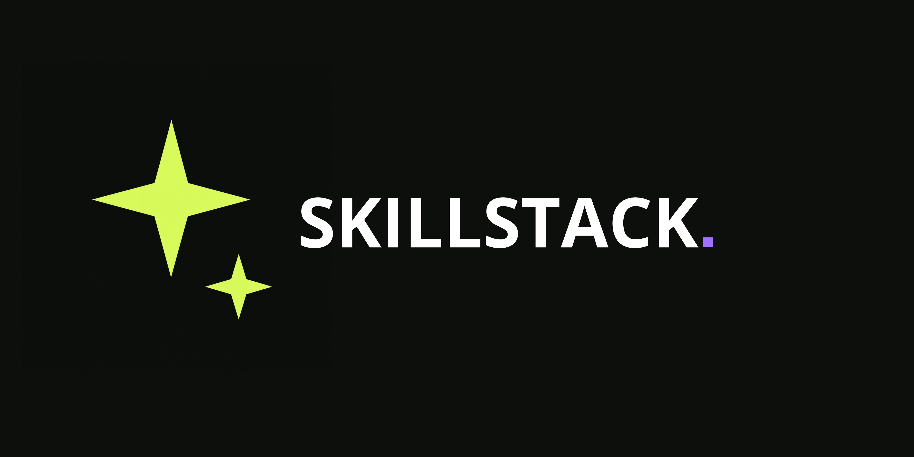

# Skillstack



Skillstack es un catálogo de skills para equipos que construyen aplicaciones full stack. Centraliza criterios reutilizables para frontend, backend, datos, infraestructura, calidad y arquitectura.

## Objetivo

El proyecto mantiene dos capas:

- Un catálogo web para descubrir skills y su área de aplicación.
- Skills nativas, versionadas dentro del repositorio, para que su contenido pueda revisarse y evolucionar como código.

No se incorporan copias monolíticas de documentación externa.

## Modelo de distribución

Las skills compartidas por un proyecto se distribuyen mediante **vendorization**: sus archivos se incorporan y versionan dentro del repositorio consumidor, en lugar de depender de una instalación global por máquina.

```text
Repositorio o catálogo de origen
        ↓
Referencia a una versión concreta de la skill
        ↓
Importación mediante CLI, agente o copia controlada
        ↓
`.agents/skills/<skill-name>/` dentro del proyecto
        ↓
Commit, code review y actualización deliberada
```

El flujo esperado es:

1. Seleccionar una skill y una versión concreta desde su repositorio o catálogo de origen.
2. Incorporar sus archivos al repositorio consumidor mediante el mecanismo compatible con la herramienta utilizada.
3. Ubicarla normalmente en .agents/skills/<skill-name>.
4. Revisar su contenido antes de incorporarla.
5. Versionarla junto con el código y actualizarla mediante cambios explícitos.

Este modelo evita depender de configuraciones globales no compartidas. La versión efectiva de cada skill queda visible en el repositorio, participa en code review y puede reproducirse en cualquier entorno del equipo.

La descarga pública incluye únicamente los recursos operativos. `metadata.json` es un manifiesto interno de Skillstack: no se descarga ni se necesita para usar una skill vendorized. Si una importación lo incluyera, debe eliminarse del proyecto consumidor.
<br />
<br />

## Estructura de una skill mantenida por Skillstack

```text
<skill-name>/
├── SKILL.md       Punto de entrada: alcance, disparadores y orientación
└── references/    Documentación complementaria cargada bajo demanda
└── metadata.json  Estado, versión, mantenimiento y trazabilidad de origen

```

| Recurso              | Tipo       | Contrato                                                                                                                            |
| :------------------: | :--------: | :----------------------------------------------------------------------------------------------------------------------------------:|
| `SKILL.md`           | Markdown   | Define el alcance compartido, los disparadores y las decisiones operativas de la skill.                                             |
| `references/`        | Directorio | Contiene patrones, guías y procedimientos que se cargan solo cuando la tarea los necesita.                                          |
| `metadata.json`      | JSON       | Manifiesto interno: declara versión, estado de migración, responsable, fechas y procedencia. No interviene en la ejecución ni se distribuye al consumidor.
<br />
<br />

### Paquete público vendorized

```text
<skill-name>/
├── SKILL.md       Instrucciones operativas
├── references/    Documentación necesaria bajo demanda
├── scripts/       Automatización necesaria, si aplica
└── assets/        Recursos de salida necesarios, si aplica
```

`metadata.json` y `evals/` quedan en Skillstack como infraestructura de mantenimiento. El proyecto consumidor identifica la versión incorporada mediante el commit SHA, tag o release que eligió al vendorizar.

## Convenciones operativas

Skillstack separa el impacto de una regla, su orden de aplicación y el nivel de obligatoriedad de su redacción. Ninguno sustituye a los otros.

| Recurso | Detalle |
| :---: | :--- |
| `priority` | Impacto de ignorar una guía. Valores permitidos: `CRITICAL`, `HIGH`, `MEDIUM` y `LOW`. No define orden de ejecución. |
| `dependsOn` | Referencias que deben leerse o aplicarse antes. Define la secuencia mediante dependencias, no mediante números. |
| `MUST`, `SHOULD`, `MAY` | Lenguaje normativo dentro de una instrucción: obligatorio, recomendado u opcional. |

Las dependencias forman un grafo sin ciclos: una referencia solo se procesa cuando sus `dependsOn` están resueltos. Esto permite respetar el orden necesario y mantener independientes las guías que no dependen entre sí.

## Manifiesto interno: metadata.json

`metadata.json` sirve a Skillstack para gobernar la evolución de sus skills. No configura agentes, no se carga durante una tarea y no forma parte del paquete público.

```json
{
  "schemaVersion": 1,
  "name": "example-skill",
  "version": "1.0.0",
  "status": "native",
  "maintainer": "skillstack",
  "createdAt": "2026-09-04",
  "updatedAt": "2026-09-04",
  "abstract": "A maintained Skillstack skill.",
  "sources": []
}
```

| Recurso        | Tipo     | Contrato                                                                                                                      |
| :------------: | :------: | :---------------------------------------------------------------------------------------------------------------------------: |
| `schemaVersion`| integer  | Versión del esquema de metadata. Actualmente: `1`.                                                                           |
| `name`         | string   | Identificador estable; coincide con el directorio de la skill y el campo `name` de `SKILL.md`.                               |
| `version`      | string   | Versión semántica de la guía mantenida por Skillstack.                                                                       |
| `status`       | string   | `native` para una guía propia; `migrating` mientras una fuente externa continúa en adaptación.                              |
| `maintainer`   | string   | Responsable actual de mantener la skill.                                                                                     |
| `createdAt`    | string   | Fecha de creación en formato ISO `YYYY-MM-DD`.                                                                               |
| `updatedAt`    | string   | Fecha de la última modificación de la versión vigente, en formato ISO `YYYY-MM-DD`.                                          |
| `abstract`     | string   | Resumen corto de la capacidad y el límite de la skill.                                                                       |
| `sources`      | array    | Orígenes externos relevantes para la trazabilidad interna. Puede ser un arreglo vacío cuando la skill no deriva de una fuente externa.                   |
<br />

### Contrato de sources

| Recurso               | Tipo     | Contrato                                                                                                                      |
| :-------------------: | :------: | :---------------------------------------------------------------------------------------------------------------------------: |
| `repository`          | string   | URL canónica del repositorio o documentación usada como fuente.                                                               |
| `revision`            | string   | Referencia inmutable: commit SHA, tag o release. No admite `main`, `latest` ni `canary`.                                     |
| `reviewedAt`          | string   | Fecha en formato ISO `YYYY-MM-DD` en la que esa revisión fue evaluada para incorporarla o adaptarla.                         |
